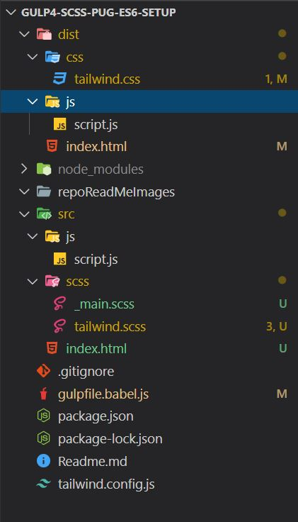

# Frontendfunn

This Repo is made using the gulp4, which supports `tailwind.css`.

Folder Structure for the Repo



- `dist` - contains the following list of folders and files

  - `css` - contains compiled `src/scss/tailwind.scss` -> `tailwind.css`.

  - `js` - contains `script.js`.

---

- `src` - contains the followinf list of folders and files
  - `js` - contains custom `script.js`
  - `scss` - contains `tailwind.scss` and other SCSS Partials `_main.scss` files.
  - `index.html | *.html` - supports `*.html` files. Unused classes inside this html files are purged using `tailwind.config.js`.

```
purging of classes is supported only for *.html files.
```

---

- `gulpfile.babel.js` - used by gulp for running the tasks.(including the browsersync).

- `tailwind.config.js` - tailwindcss config file.

---

## Made with ❤ by [FrontendFunn](https://www.youtube.com/channel/UCpOHt5d6GG-mvo-_pU06rhQ?sub_confirmation=1)
